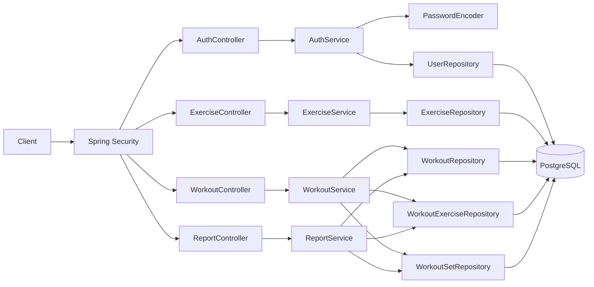

# Workout Tracker API Architecture Draft

## Current scaffold (today)

```text
Client (Postman/Web)
        |
        v
Spring Security Filter Chain
        |
        +--> permitAll: /api/v1/health, /api/v1/auth/**, Swagger
        |
        v
HealthController (/api/v1/health)
        |
        v
JSON response {status, service, timestamp}
```

## Near-term target (register first)

```text
Client (POST /api/v1/auth/register)
        |
        v
AuthController
        |
        v
AuthService.register()
   |            |
   |            +--> PasswordEncoder (BCrypt)
   |
   +--> UserRepository (JPA)
                |
                v
        PostgreSQL users table
                |
                v
RegisterResponse (id, email, displayName)
```

## Component view (target v1)



